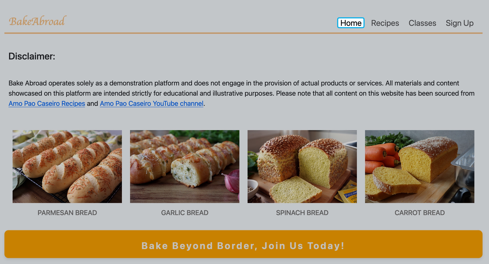
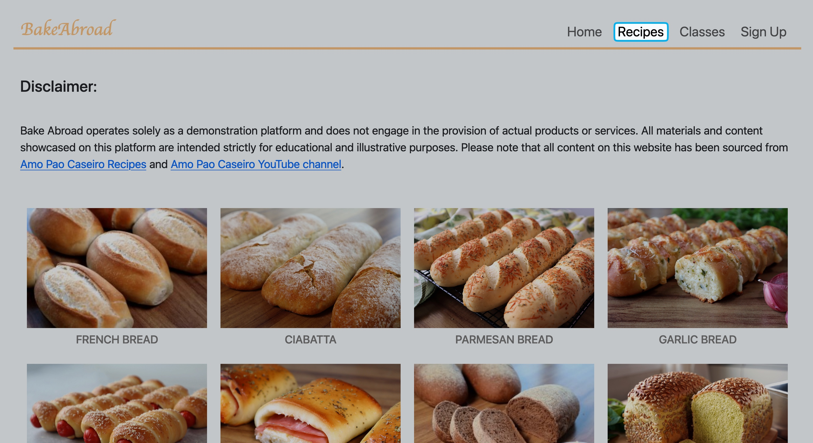
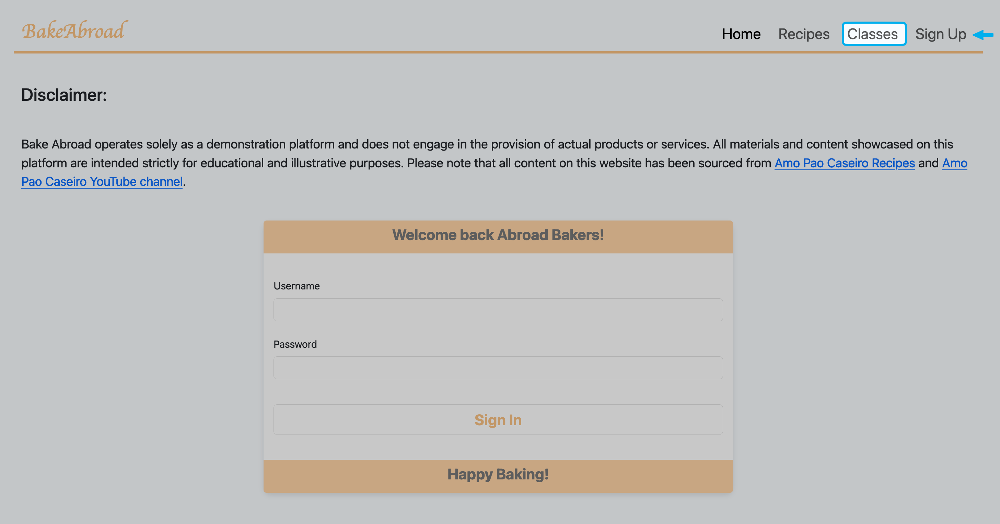
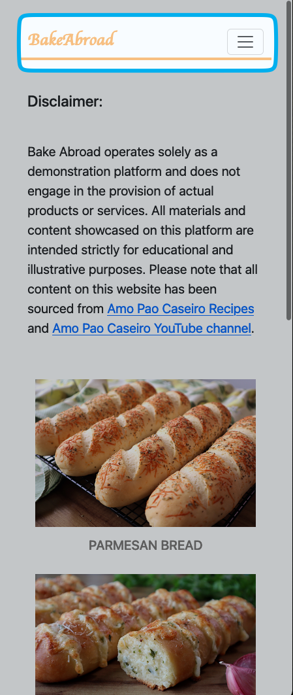
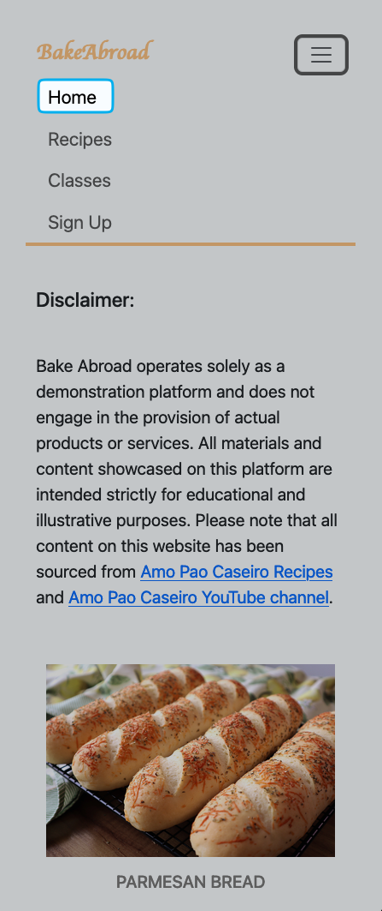
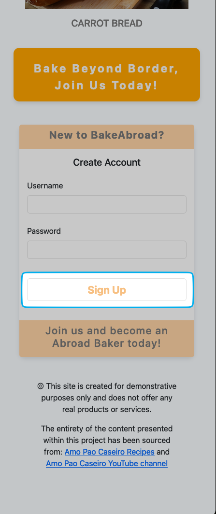
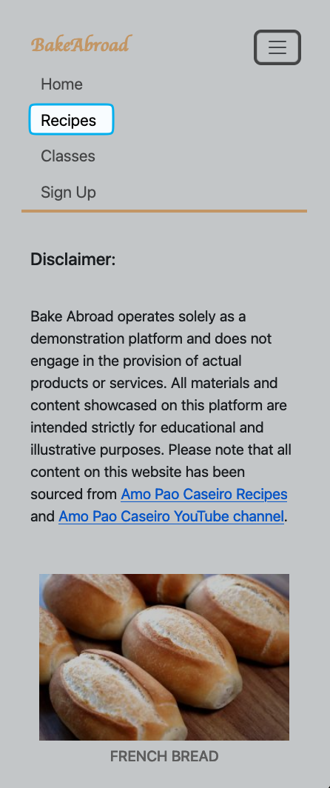
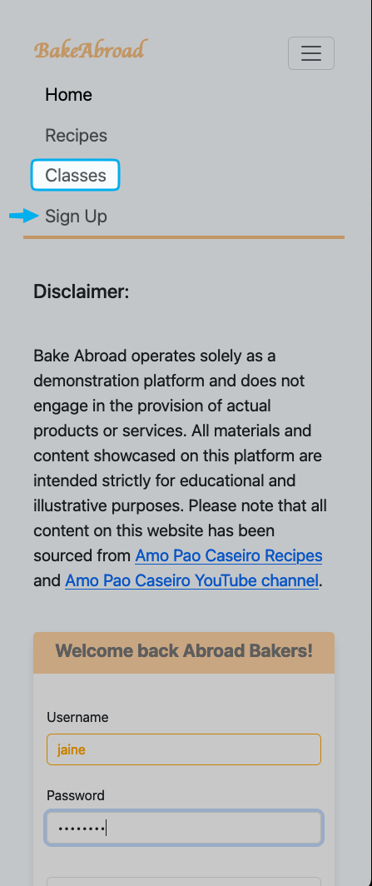
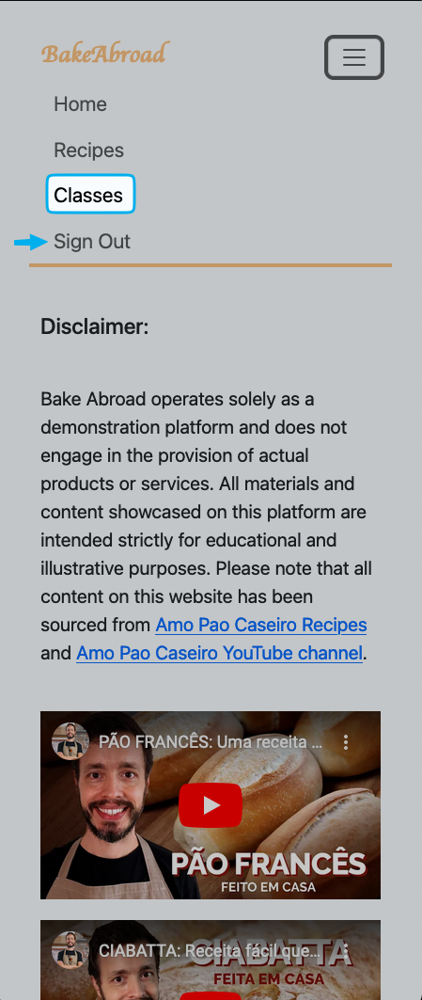

# Web Application with Node Express

**BakeAbroad** is a Node.js and Express.js dynamic web application that demo my skills in building reliable, feature-rich web solutions with seamless user authentication and MongoDB database integration. Please note that all the images, videos, and recipes you see in this project were retrieved from [amopaocaseiro.com.br/receitas](https://amopaocaseiro.com.br/receitas/) and [youtube.com/@amopaocaseiro](https://www.youtube.com/@amopaocaseiro).

## Features

- User authentication with Passport.js and Passport-local strategy
- Session management with Express-session
- MongoDB integration with MongoDB Node.js driver
- Frontend styling with Bootstrap
- Dynamic HTML rendering with EJS template engine

## Getting Started

1. **Clone the repository**: `git clone <repository-url>`
2. **Navigate to the project directory**: `cd <BakeAbroad>`
3. **Install dependencies**:

   ```
   npm install
   ```

4. **Set up environment variables**: Create a `.env` file in the root directory based on the provided `.env.example` file.
5. **Start the server**:
   ```
   npm start or nodemon server.js
   ```

## Configuration

- Check the `config/passport.js` file for Passport.js configuration.
- MongoDB connection URI should be set in the `.env` file.

## Usage

- Visit [http://localhost:4000](http://localhost:3000) in your browser to access the app. The application is configured to run on port 4000 by default, with a fallback to port 3000.
- You can register a new username and password or sign in with the credentials you've previously created.

## Deployment and Production

When deploying your Node.js and Express.js application to a production environment, follow these steps:

1. **Install Dependencies**: Ensure all dependencies are installed by running:

   ```
   npm install --production
   ```

2. **Build for Production**: If your application includes frontend assets that need to be bundled, minified, or optimized, run the build command:

   ```
   npm run build
   ```

3. **Start the Application in Production Mode**: Run the application in production mode:

   ```
   npm start
   ```

   Make sure to set any necessary environment variables for your production environment.

**For more information on deploying Node.js and Express.js applications** refer to the documentation of your hosting provider or deployment platform.

## Screenshots

### Desktop








### Mobile

 
 
 

## Contributing

Contributions are welcome!
